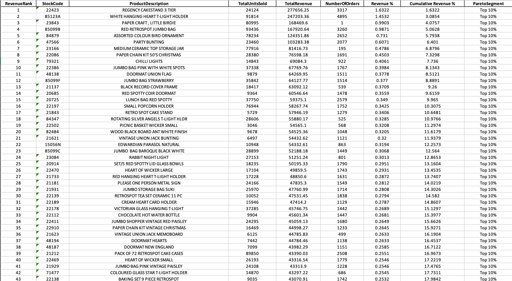

# Retail Sales Analysis | SQL · Excel · Python

End-to-end data pipeline and Pareto analysis on 1,067,371 e-commerce transactions — demonstrating data engineering, advanced SQL, and business intelligence skills.



## Business Objective

A UK-based online retailer generates millions of transactions annually. This project answers one commercial question:

> *Which products disproportionately drive revenue, and by how much?*

Understanding revenue concentration lets a business prioritise inventory procurement, renegotiate supplier contracts for high-value SKUs, and design targeted promotional strategies — each directly impacting margin.

## Dataset

| Attribute | Detail |
|---|---|
| Source | [UCI Online Retail II](https://archive.ics.uci.edu/dataset/502/online+retail+ii) |
| Scope | UK-based online retailer, Dec 2009 – Dec 2011 |
| Raw rows | 1,067,371 |
| After cleaning | 775,543 |
| Unique products | 4,616 SKUs |
| Unique customers | 5,852 |
| Countries | 41 |
| Total revenue | £17,011,271 |

## Technical Stack

- **Python 3.11** — pandas · sqlite3 · openpyxl
- **SQLite** — local analytical database
- **SQL** — CTEs · Window Functions (RANK · SUM OVER · COUNT OVER)
- **Excel** — Pareto combo chart · PivotTables · Slicers

## Methodology

### Data Engineering — pipeline.py

Loads both annual sheets from the raw Excel file (or CSV), validates the schema, and applies a multi-stage cleaning process before writing to SQLite.

| Stage | Rows Removed |
|---|---|
| Cancellation invoices (Invoice starts with C) | 19,494 |
| Non-product stock codes | 9,421 |
| Non-positive Quantity or Price | 6,108 |
| Missing CustomerID | 230,789 |
| Exact duplicates | 26,016 |

A `LineRevenue` column (`Quantity × Price`) is added at pipeline stage and stored in the database so it does not need to be recalculated at query time.

### Analytical SQL — pareto_analysis.sql

A four-CTE chain segments products by revenue contribution entirely inside SQLite.

```
product_revenue → revenue_ranked → pareto_flagged → (final SELECT)
```

- `RANK() OVER` ranks each product by descending revenue
- `SUM(...) OVER (ROWS BETWEEN UNBOUNDED PRECEDING AND CURRENT ROW)` builds the cumulative revenue line
- `COUNT(*) OVER ()` makes the total product count available without a subquery
- `CEIL(TotalProducts * 0.10)` sets the top-10% threshold dynamically — it adapts if the dataset grows

### Visualisation — Excel

The SQL output is exported to `pareto_output.xlsx` via `export_to_excel.py` and used to build a combo chart (clustered bar for revenue per product, line for cumulative %) and an interactive dashboard with slicers.

## Key Finding

The top 10% of SKUs (~462 products) account for approximately 60% of total portfolio revenue — consistent with the Pareto Principle.

Notable: Rank #3 (PAPER CRAFT, LITTLE BIRDIE) generated £168,469 from a single order, indicating a bulk B2B purchase. Retained in the analysis as genuine revenue but flagged as an outlier for merchandising purposes.

## Reproduce

```bash
git clone https://github.com/Swayam-arora-2004/Retail-Sales-Analysis.git
cd Retail-Sales-Analysis
pip install -r requirements.txt
```

Download `online_retail_II.csv` from the [UCI ML Repository](https://archive.ics.uci.edu/dataset/502/online+retail+ii) and place it in the project root, then:

```bash
python pipeline.py
python export_to_excel.py
```

## Structure

```
├── pipeline.py
├── pareto_analysis.sql
├── export_to_excel.py
├── requirements.txt
└── README.md
```

## Skills

`Python` · `pandas` · `SQLite` · `SQL Window Functions` · `CTEs` · `Pareto Analysis` · `Data Cleaning` · `Excel` · `Business Intelligence`

---

*Dua, D. and Graff, C. (2019). UCI Machine Learning Repository. University of California, Irvine.*
